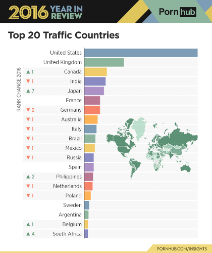

```{r setup, include=FALSE}
knitr::opts_chunk$set(echo = TRUE)
```

```{r libraries, include=FALSE}
library(devtools)
library(rmarkdown)
library(jsonlite)
library(rvest)
library(stringr)
```

### Question

Is there a correlation between the safer sex practices (condom use = yes or no) employed in gay porn videos viewed on popular pornographic websites in the United States in the last 5 - 10 years and:

1. PrEP's US timeline

* approval of Truvada for pre-exposure prophylaxis
* news cycle and ad campaigns
* major health department efforts
* cultural mentions

2. Rates of gonorrhea, syphilis, and chlamydia among men who have sex with men (MSM) in the USA

3. Timelines of gay male geosocial dating apps (Grindr, Scruff, etc.)?

A descriptive(?) data analysis of gay male pornographic videos available online and their viewing trends over the past 5-10 years.

Regression - Discontinuity:

Films designated as "visible condom use" = 0 for no, 1 for yes.
Measures: Total views for films
"Program" group: Films produced after the cutoff, average of most popular gay pornographic films on PornHub (between 0 and 1)
"Control" group: Films produced before the cutoff, average of most popular gay pornographic films on PornHub (between 0 and 1)
Cutoff: Some timepoint, most probably approval of Truvada as PrEP in the USA + an unknown amount of lag time

Source: Stephen pointed me to the [Regression-Discontinuity design](https://www.socialresearchmethods.net/kb/quasird.php).

---

### Background:

#### PornHub

[PornHub](www.pornhub.com) is the world's largest pornography site on the internet, operating now for 10 years. Currently, it is the 39th most popular site on the web. Operating similarly to YouTube, PornHub claims itself as a "platform" and a "video host:" in such a way, PornHub is capable of reaping the benefits of the massive traffic generated to its site while claiming no responsibility for the videos therein. In 2010, the start-up was bought out by a large adult entertainment conglomerate Manwin (now known as MindGeek), who owns several other similar websites.

Started in 2013, [PornHub Insights](https://www.pornhub.com/insights) is a blogging platform wherein the massive quantities of data reaped from PornHub users would be periodically analyzed. Insights posts were generally themed around a particular large event, monitoring traffic changes around NBA finals, episodes of Game of Thrones, or the path of totality for the 2017 solar eclipse. Occassionally, and at the end of every year, PronHub Insights will break down data more generally, by geography, times of access, popularity of search terms and categories, etc.

#### PrEP

Pre-exposure prophylaxis, or PrEP, is the preemptive use of a drug to prevent disease in unexposed populations. Currently, the term is used almost exclusively as shorthand for the use of the antiretroval drug Truvada, a two-drug combo manufactured by Gilead Sciences, to prevent the replicaton of HIV. Truvada's regimen as of the time of writing is a single pill taken daily coupled with a follow-up visit with the patient's primary care provider every three months, presumably in perpetuity.

Truvada has had the most adoption success among men who have sex with men in the United States after approval by the CDC for use as PrEP in 2014. Moves toward widespred adoption of PrEP have been divisive, politically and within gay culture. Concerns include the likelihood of PrEP being used counter to the prescription (such as in the phenomenon of "disco dosing," an ineffective practice in which men take a Truvada pill only around the time they expect sex), the potential for PrEP to undermine existing safer sex policies and social mores, and the incredible cost of the drug (as high as $450 / month). As of 2017, Truvada as PrEP has been approved by 9 countries in addition to the United States as well as the World Health Organization.

#### Gay Porn

Since the AIDS crisis in the 1980s, condoms have been standard parts of gay pornographic films. While condom-less gay porn ("barebacking") still did exist, it was commonly regarded as kink, fetish, or otherwise deviant, and was often the domain of specialized or heterodox smaller production studios.

In recent years, porn studios, both gay and straight, have seen their profits being eaten in to by a combination of three phenomenons:

1. The rise of the "tube" sites (such as PornHub), which aggregate and disseminate pornography, usually without a membership fee,
2. The piracy of pornography and distribution via peer-to-peer networks and forums,
3. and burgeoning competition from amateur, DIY pornographers, many of which are capable of providing bareback porn, being unrestrained by mainstream conventions.

With the advent of PrEP, however, gay porn studios suddenly had an out: they could provide bareback sex for audiences who preferred it while still bearing the mantle of "safer" sex. Most large gay pornographic studios began producing bareback porn in the years following the CDC's endorsement of Truvada as PrEP.

---

#### Obtaining the raw data

##### Limitations:

1. Data by Country Viewership

Unfortunately, due to [PornHub's robots.txt](https://www.pornhub.com/robots.txt), I am unable to specifically scrape by country code:

> Disallow: /\*cc=\*

However, their own published web traffic data by country allows for a reasonable assumption that broader trends found without country code incorporated could reflect USA-specific viewing trends:

<center></center>

<center></center>

2. Viewership of videos by MSM

PornHub provides a specific [url stem](https://www.pornhub.com/gayporn) to cordon off "gay" porn from the main site's "straight" porn, the top-level domain. Essentially, the category "Gay" is applied to videos in this section of the website, as a high-level video filter. For the purpose of this analysis, the assumption is made that MSM would seek out porn from this gay porn section of the website. According to PornHub's own usage statistics for 2016, ~3% of visitors from the US are "gay visitors," a statistic that is commensurate with national surveys on American's sexual orientation.

<center></center>

3. Video Upload Dates

Working on this.

4. Reliance on text descriptors of videos

For this analysis, I am relying on text descriptors, both user-supplied (video title, tags) and host-supplied (categories), in order to determine if a video contains sex between two or more performers without use of condoms. This introduces a potential for incorrect classification, but viewing individual videos is outside of the scope of this project.

#### EDA

##### Word frequency in titles

##### Popularity Ranking

Popularity ranking reveals categories by the number of views generated by all videos in a given category, weighted by the number of these videos. This shows the repetition of views on videos in a given category, revealing the consistency of viewers’ requests for this content. These categories may point to content for which demand surpasses what is offered by uploaders.

##### Semantic Networks

Edge Strength = (Number of videos in which tag i and tag j occur in together \* total number of videos in dataset) / (number of videos with tag i \* number of videos with tag j)

##### Louvain algorithm

community detection method, often referred to as the Louvain algorithm (Blondel et al. 2008), to identify cohesive subsets of tags in the corpus. These ‘clusters’ gather densely connected tags that are relatively disconnected from the rest of the network and may form semantically coherent units. In Figure 2 each node is coloured according to the clusters to which it belongs.

##### Nicheness

We simply define the nicheness score of a tag as the sum of the preferential links connecting this tag to its relevant neighbours.

#### Data processing

```{rvest code}

```
  
#### Make data publicly available by end of class

#### You must specify your own question you are asking from the data

#### Reasonable justification I can answer the question with my data

##### Word Cloud - Tags

Tags are essentially user-generated categories for videos. I created a wordcloud out of the 200 most common:

```{r tagcloud, echo=FALSE}

```

##### STI time series data

Will utilize [CDC data](https://www.cdc.gov/std/stats15/msm.htm) for country-wide rates of HIV, gonorrhea, chlamydia, and syphilis (early latent, primary, and secondary) among MSM,


END